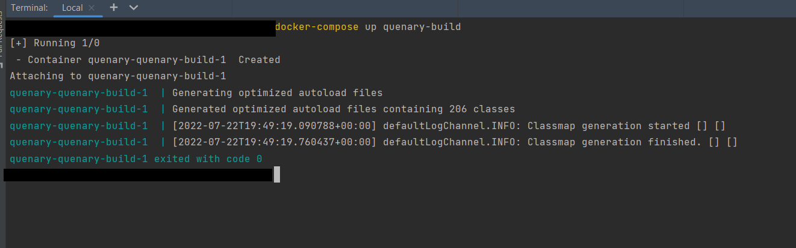
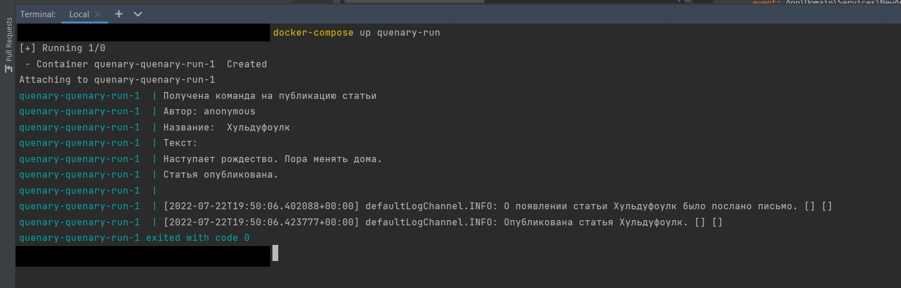

# Quenary

Это - простая шина сообщений публикатор/подписчик. Основана на аннотациях и рефлексии, использует принципы CQRS.

Согласно CQRS, есть команды, есть запросы, есть события. И есть хэндлеры. 
Команда содержит данные для изменения какого-то ресурса. Запрос содержит данные 
для извлечения ресурса. Событие - ну, событие. 
Хэндлер - функция, которая либо обрабатывает команду, либо отвечает на запрос, 
но не то и другое одновременно. 

Где-то в коде на шину команд может быть выставлена команда. Тип команды - строка из заранее написанного ENUM'а. 
Вместе с типом выставляется какой-то payload - просто объект с данными.
Шина команд знает все обработчики для команд каждого типа и передаёт команду в каждый из обработчиков. 

Аналогично для запросов. На шину ставится запрос, шина находит все обработчики запроса и возвращает результат от каждого из обработчиков.
Аналогично для событий. 

Общее название для событий, команд и запросов - message. 

Хэндлерами могут являться методы классов. Чтобы сделать метод хэндлером для команды, перед ним нужно написать 
```#[CommandHandler(тип)]```. Хэндлером для запроса - ```#[QueryHandler(тип)]```. Методом для события - ```#[EventHandler(тип)]```.
В текущей реализации метод-хэндлер должен принимать один объект. 


## Как этим пользоваться

* Сначала сделать какой-нибудь enum с типами. Например, 
```php
// src/Domain/ArticleEventTypes.php

enum ArticleEventTypes: string implements EventTypesInterface
{
    case Command = 'huldufolk.command';
    case Query = 'huldufolk.query';
    case Event = 'huldufolk.event';
}
```
Наследоваться от EventTypesInterface обязательно, требование реализации.
Типов может быть много, не обязательно эти три.

* Дальше в коде можно выставлять на шину messages. Например, 
```php
// src/App/Controller.php

$this->dispatcher->dispatch(
    ArticleEventTypes::Command->value,
    json_encode(
        new PublishAnArticleCommand(
            'Хульдуфоулк',
            'Наступает рождество. Пора менять дома.',
            'anonymous'
        )
    )
);
```

Диспетчер ```$this->dispatcher``` - объект класса ```Qenary\Core\Dispatcher```. 
Он внедряется автоматически по месту требования контейнером, например через конструктор.

Первый аргумент метода ```dispatch``` - значение из enum'а с типами команд.
Второй аргумент - объект команды. В предлагаемой реализации команда должна быть 
объектом простого дата-класса с readonly-публичными свойствами и без каких-либо методов. 
Но stdClass использовать нельзя, класс должен быть индивидуальным.

Преобразование в json - чтобы можно было подключать к шине не только php, а какие-нибудь другие языки, 
которые могут кодировать/декодировать json. 

* Дальше какие-нибудь методы можно с помощью аннотаций делать реагирующими на события. Например, 
```php
interface NotifierService
{
    #[EventHandler(ArticleEventTypes::Event)]
    public function newArticleEventHandler(NewArticleEvent $event);
}
```
При появлении на шине события ```ArticleEventTypes::Event``` будет вызван этот метод. 
Аннотацией обработчика событий можно пометить много разных методов. 
Все они будут вызваны при появлении события (порядок вызовов не определён).

Шина с помощью гидратора создат пустой объект класса ```NewArticleEvent```
и заполнит его поля свойствами из JSON. Если каких-то свойств не будет хватать, 
вылетит исключение. При этом в JSON могут быть лишние свойства. 

Шина будет искать обработчики только у интерфейсов. Поэтому если вы хотите сделать какой-то метод вашего класса handler'ом - 
это стоит делать в одном из интерфейсов, которые класс реализует.

## Пример

В контроллере в методе doAction выставляем на шину команду создания новой текстовой статьи - 
с названием, автором и текстом. 

Обработчиком создания статьи помечен метод ```publishArticle``` класса ```ArticleService```.
Этот метод создаёт статью (ну, заглушку) и выпускает событие о том, что статья создана. 

На событие создания статьи подписаны два метода: ```LoggerService::newArticleEventHandler``` 
и ```NotifierService::newArticleEventHandler```. Первый добавляет в лог запись о создании статьи, 
второй отправляет кому-то письмо. Как только на шине появляется событие, шина вызывает эти два метода.

Дальше ничего не происходит, программа завершается. 

## Детали реализации
Для использования нужен подключенный контейнер зависимостей. Здесь используется php-di, но 
можно любой другой. 

Перед началом использования шины её нужно сконфигурировать. 
Конфигурация - yaml-файл, создаётся автоматически в tmp. Для примера выше
файл такой:

```yaml
# Event Bus handler map file
# 2022-07-22 19:38:01

command:
  huldufolk.command:
    - 
      class: App\Domain\Services\ArticleService
      method: publishArticle
      command: >
        App\Domain\Services\PublishAnArticleCommand
query: [ ]
event:
  huldufolk.event:
    - 
      class: App\Domain\Services\NotifierService
      method: newArticleEventHandler
      event: App\Domain\Services\NewArticleEvent
    - 
      class: App\Domain\Services\LoggerService
      method: newArticleEventHandler
      event: App\Domain\Services\NewArticleEvent
```

Для перебора всех классов проекта используется ```composer dump-autoload```, так что без composer'а работать не будет.

## Как потрогать
- ```docker-compose run quenary-install``` скачает и установит контейнер и другие пакеты. 
Достаточно вызвать один раз.


- ```docker-compose run quenary-build``` просмотрит исходный код и составит по аннотациям карту подписчиков. 
Нужно вызывать после каждого изменения аннотаций.


- ```docker-compose run quenary-run``` просто запустит скрипт run.php, в котором 
может быть какой-нибудь ваш код. 

## Картинки





## Тесты
```docker-compose run quenary-tests``` - юнит

## Планы на будущее

Прикрутить rabbitmq
